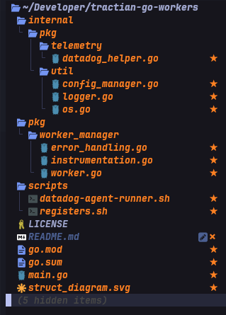

---
  __Advertisement :)__

  __[Jeffersonmf/go-workers](https://github.com/Jeffersonmf/go-workers)__
  - Project with the purpose of managing and sharing different and general
  contracts and data structures between projects.
  For now these are the dependencies to others repositories.

---

# Go-Workers
[](https://github.com/libsql/libsql/blob/master/LICENSE.md) [](https://github.com/libsql/libsql/blob/master/LICENSE.md) []() []() []() 

### Workers is a project whose purpose is to dynamically execute tasks and routines in Golang, defined through an instrumentator.

These tasks can be executed nested in a logical sequence or a flow, making use of intelligent callbacks and parallel executions through goroutines.


The application follows design patterns commonly applied by the Golang community, with the most important parts contained in the **workermanager** package.

Below, we have an example of the definitions of the main data structures of the project:

## 

### Extra Modules



- **Configurations**[]()
  - *Here we have modules capable of reading configuration in .env files and generic functions for dealing with the "environment"*

relational entities on the native code in Go.
- Util
  - Here we have several utilities of the solution such as system libraries "os"libraries, functions to create generic maps as well as slices, loggersm etc.
- Terraform and Docker Infrastructures
  - Files and scripts to support code infrastructure, containers and CICD.

<p><br />

- **Worker Manager Module** 

  - The **Worker Manager** Module, which works together with the **Instrumentation** module, is capable of executing functions dynamically, using advanced techniques such as recursion, callbacks, and reflection triggers, allowing the assembly of workflows, passing and receiving inputs and outputs, totally dynamic and concurrent.

    <p><br />

### **How can we create a Worker?** <br />

First of all, let's declare our functions that will be executed and managed by the Worker. As in the example below we have addCompaniesStep001. Its purpose is to insert a new Company.

see the example: [**addCompaniesStep001**]

```go
  //This is an example:
  func LoadRunner(args []string) {
 mainCtx := context.Background()
 db := util.CockroachConn(mainCtx)
 defer db.Close()

 boil.SetDB(db)

 addCompaniesStep001 := func(ctx context.Context, taskArg workermanager.TaskParams) (workermanager.TaskParams, error) {
  companyID := gofakeit.UUID()

  company := generator.GenerateFakeCompany(companyID)
  err := company.InsertG(ctx, boil.Infer())
  if err != nil {
   util.Sugar.Infof(err.Error())
  }

  taskArg.SetStringParam("companyID", companyID)

  return taskArg, err
 }
```

Next, we will declare the second step in which it will be executed in a callback corresponding to the end of the first Step. [**addUserStep002**]

Note that each execution will return a corresponding callback and this callback may contain a next function that in turn will return another callback in the sequence, thus having a recursive flow, as if it were a linked list of functions with returns.

```go
    addUserStep002 := func(ctx context.Context, taskArg workermanager.TaskParams)  error {
      companyId, _ := taskArg.GetStringParam("companyID")

      userProfilePictures := generator.GenerateUserProfilePic(companyId)

      err := userProfilePictures.InsertG(ctx, boil.Infer())
      if err != nil {
        util.Sugar.Infof(err.Error())
        return taskArg, err
      }
      user := generator.GenerateUser(companyId, userProfilePictures.ID)
      err = user.InsertG(ctx, boil.Infer())
      if err != nil {
        util.Sugar.Infof(err.Error())
      }

      params := workermanager.NewTaskParams()
      params.SetStringParam("userProfilePicID", userProfilePictures.ID)
      params.SetStringParam("companyID", companyId)

      return taskArg, err
    }
```

Now we have the most important part, which is precisely the declaration of the Worker and the beginning of the execution of our interconnected tasks.
[**yourTaskFunc001**]

```go
  func yourTaskFunc001 {
  ...
    workermanager.Worker{
      SourceContext: mainCtx,
      Instrumentation: workermanager.Instrumentation{
        TaskArguments:  workermanager.NewTaskParams(),
        FuncDispatcher: addCompaniesStep001,
        NestedCallback: addUserStep002,
        FuncName:       "addCompanies",
      },
      ExecsPerTick: companiesToCreatePerTick,
      TickDuration: time.Second * 20,
    }.Run()
    util.Sugar.Infof("Finished")
  }
```

- **Tests**
  - The automated test routines trigger the simulator and try to reach the limits of CPU resources, using resources such as goroutines, mutex, channels, and blocks with thousands of concurrent processes.
