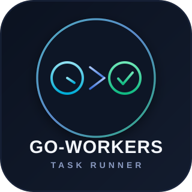
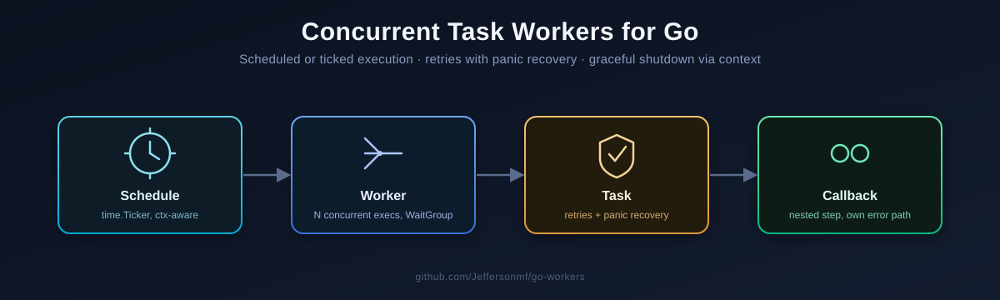
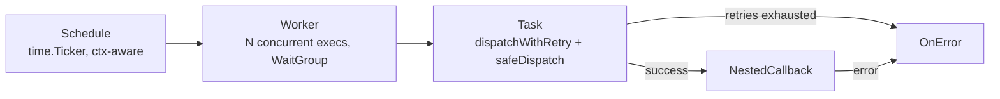
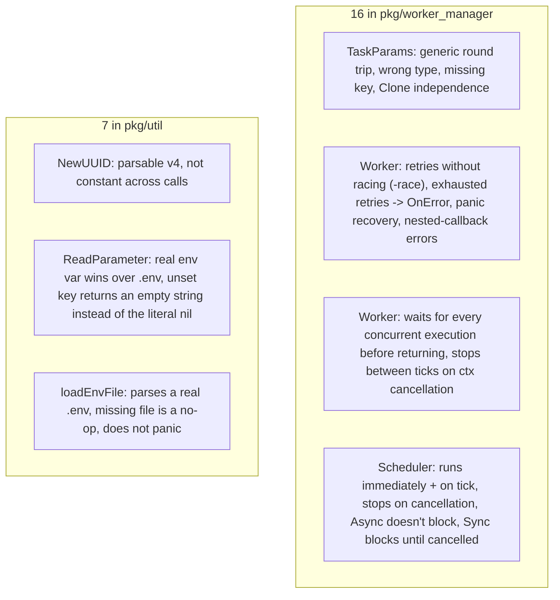

<p align="center">
  
</p>

# ⚙️ go-workers


-brightgreen.svg)


**Author:** [Jefferson Marchetti](mailto:jeffersonm.ferreira@gmail.com)



## Overview

A small library for running caller-defined task functions concurrently,
on a schedule or as repeated ticks, with retries and panic recovery
around every execution, and graceful shutdown wired through
`context.Context`.

This is a rewrite of a personal project originally written in 2023.
The rewrite is not cosmetic: the concurrency model had a real data
race in its retry logic, a panic-recovery path that nothing ever
called, and other issues documented with reproductions in
[`docs/trade-offs.md`](./docs/trade-offs.md). Every fix there is backed
by a test that fails without it. A second pass then replaced the
library stack itself (`zap` → `log/slog`, `viper`+`fsnotify` → a
20-line `.env` loader), taking the module's direct dependencies from
four down to one.

## Features

- Retries with panic recovery around every task execution: a panic in
  a caller-supplied function is converted to an error, not a crashed
  process.
- Concurrent execution per tick, waited for with `sync.WaitGroup`:
  `Worker.Run()` does not return until everything it started has
  finished or been cancelled.
- Scheduling via the standard library's `time.Ticker`, stopped through
  `context.Context` cancellation, no separate `Stop()` mechanism to
  keep in sync with the rest of the package.
- Generic `TaskParams` (`SetParam[T]`/`GetParam[T]`) instead of one
  method pair per supported type.
- Structured logging via the standard library's `log/slog`, config via
  a dependency-free `.env` + real env var loader: one direct
  dependency in the whole module (`google/uuid`).
- 23 tests, including `go test -race`, and a `TestMain` that fails the
  suite on any leaked goroutine (`go.uber.org/goleak`).
- Static binary, 7MB Docker image (`FROM scratch`, no cgo).

## Architecture


```mermaid
flowchart LR
    S["Schedule\ntime.Ticker, ctx-aware"] --> W["Worker\nN concurrent execs, WaitGroup"]
    W --> T["Task\ndispatchWithRetry + safeDispatch"]
    T -->|success| C["NestedCallback"]
    T -->|retries exhausted| E["OnError"]
    C -->|error| E
```

Every task execution goes through `safeDispatch` (panic → error via
`recover()`) inside `dispatchWithRetry` (up to `MaxRetries` sequential
attempts, in the same goroutine, so there is nothing to race on across
goroutines). Failures that exhaust their retries, and `NestedCallback` errors,
both go through the same `OnError` hook. Details in
[`docs/design.md`](./docs/design.md).

## Requirements

- Go 1.27+
- Docker (optional, for the container build)

## Running it

```bash
make run
```

Runs the bundled example (`main.go`): a worker scheduled every 5
seconds, fetching a small in-memory batch and logging each record.
`Ctrl+C` triggers a graceful shutdown (`signal.NotifyContext`): the
in-flight tick finishes before the process exits.

## Verification

```bash
git clone <this-repository> && cd go-workers
make check
```

`make check` runs `gofmt -l`, `golangci-lint run`, and the full test
suite with the race detector. Expected output:

```text
0 issues.
ok  	github.com/Jeffersonmf/go-workers/pkg/util
ok  	github.com/Jeffersonmf/go-workers/pkg/worker_manager
```

`gofmt -l` and `golangci-lint` produce no output when there are no
problems. Requires Go 1.27+ and `golangci-lint` on `PATH`.

To verify the Docker image:

```bash
make docker-build
docker run -d --name gw-check go-workers:latest
sleep 2
docker logs gw-check                # should show "go-workers example starting" + persisted records
docker stop gw-check                # sends SIGTERM; should exit cleanly, no forced kill
docker rm gw-check
```

## Tests

23 tests (`make test-race`):


```mermaid
flowchart TB
    subgraph WM["16 in pkg/worker_manager"]
        WM1["TaskParams: generic round trip, wrong type, missing key, Clone independence"]
        WM2["Worker: retries without racing (-race), exhausted retries -> OnError, panic recovery, nested-callback errors"]
        WM3["Worker: waits for every concurrent execution before returning, stops between ticks on ctx cancellation"]
        WM4["Scheduler: runs immediately + on tick, stops on cancellation, Async doesn't block, Sync blocks until cancelled"]
    end
    subgraph U["7 in pkg/util"]
        U1["NewUUID: parsable v4, not constant across calls"]
        U2["ReadParameter: real env var wins over .env, unset key returns an empty string instead of the literal nil"]
        U3["loadEnvFile: parses a real .env, missing file is a no-op, does not panic"]
    end
```

`TestMain` wraps the `worker_manager` suite in
`goleak.VerifyTestMain`, so a goroutine leak anywhere fails the build,
not just a silently growing process.

## Development

```bash
make help         # lists every command with a description
make build         # go build -o bin/go-workers .
make test-race       # go test ./... -race
make test-cover        # go test ./... -cover
make lint                # golangci-lint run
make fmt                   # gofmt -w .
make check                    # fmt-check + lint + test-race (what CI runs)
```

## Docker

```bash
make docker-build   # 7MB final image
make docker-run      # runs the example inside the container
```

Multi-stage build: `golang:1.27-bookworm` compiles a static binary
(`CGO_ENABLED=0`; nothing in this module's dependency tree uses cgo),
the final image is `FROM scratch`, no shell, no dynamic libc.

## Project structure

```
pkg/
  util/
    logger.go            Logger (log/slog), set via a var initializer, see docs/trade-offs.md #2, #11
    config_manager.go       .env + real env vars, zero dependencies, see docs/trade-offs.md #12
    os.go                     NewUUID, LogMemStats
  worker_manager/
    instrumentation.go   TaskParams (generic Set/GetParam), Instrumentation
    scheduler.go            runOnSchedule (time.Ticker, ctx-cancellable)
    worker.go                 Worker: retries, panic recovery, WaitGroup
    error_handling.go            TaskError
main.go               runnable example: scheduled worker + graceful shutdown
docs/
  design.md               architecture, the concurrency redesign, and the library swap
  trade-offs.md              12 documented findings, each with a reproduction
  assets/                       banner.svg, logo.svg
.github/workflows/ci.yml   fmt + lint + test -race + docker build, on every push
```

## Technical decisions

Summary; full detail and reproductions in
[`docs/trade-offs.md`](./docs/trade-offs.md):

1. **Retry logic rebuilt**: the original raced a goroutine's channel
   send against a non-blocking `select` in the caller, so retries almost
   never actually fired. Now sequential, in the same goroutine.
2. **Panic recovery actually wired in**: a recovery method existed but
   nothing called it. `safeDispatch` wraps every task execution.
3. **`Worker.Run()` waits for its goroutines**: the original returned
   before spawned executions finished.
4. **`time.Ticker` instead of `go-co-op/gocron`**: the only use was
   "run every N seconds", already in the standard library.
5. **Generics for `TaskParams`**: two functions instead of fourteen
   near-identical methods.
6. **`log/slog` instead of `zap`, a dependency-free `.env` loader
   instead of `viper`+`fsnotify`**: the module's direct dependencies
   went from four to one, and `slog.New`'s inability to fail
   structurally eliminates the nil-logger bug class from point 2.

## License

[MIT](./LICENSE)

## Contact

**Jefferson Marchetti**
[jeffersonm.ferreira@gmail.com](mailto:jeffersonm.ferreira@gmail.com)
